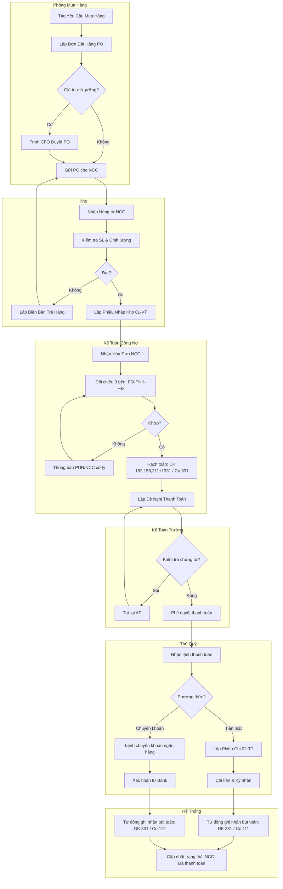
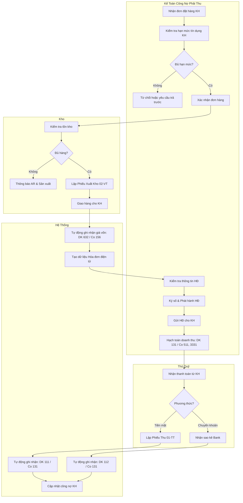
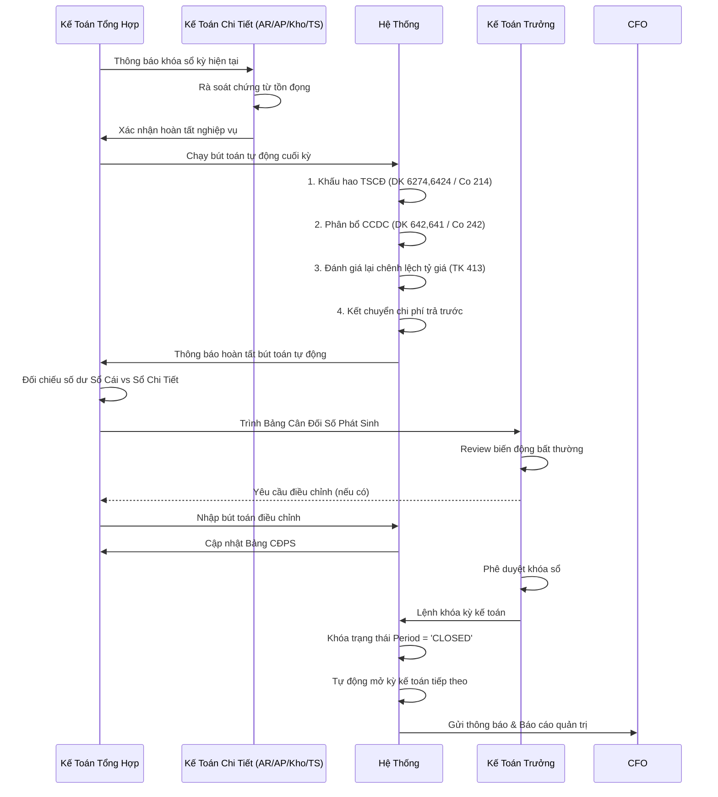
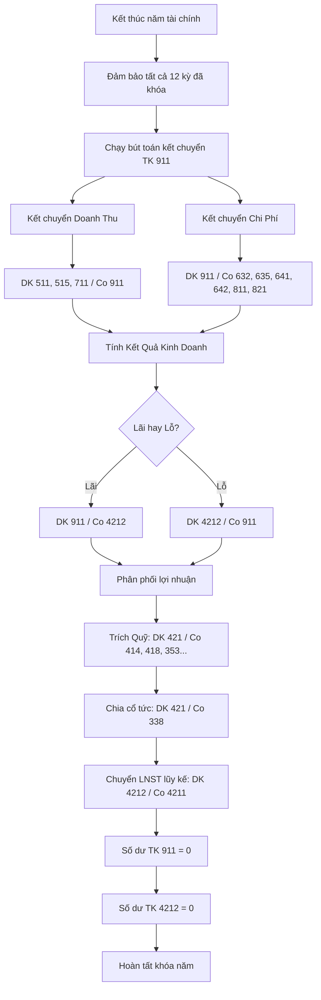
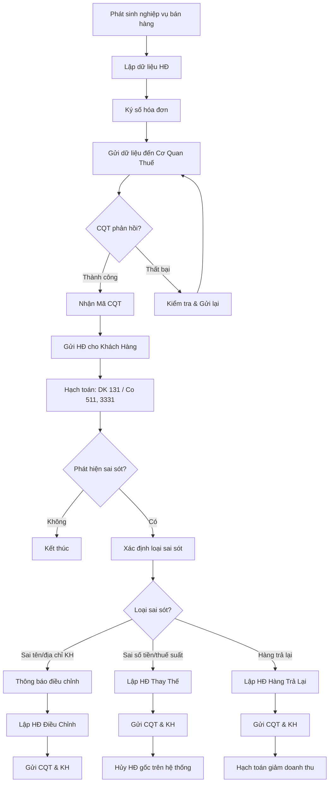
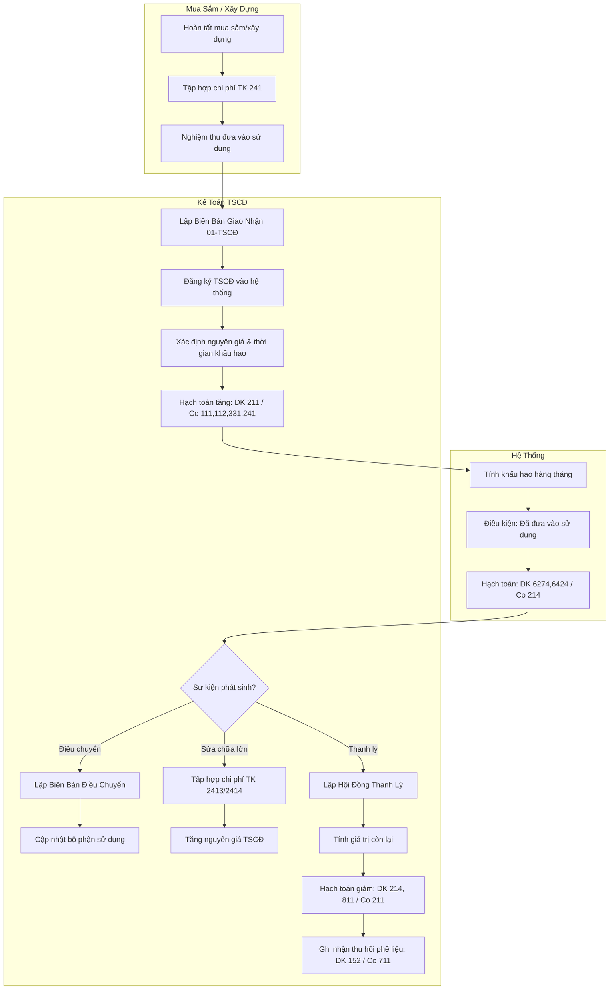

# PROCESS FLOWS DOCUMENT
# Vietnamese Enterprise Accounting Software
# Compliant with Circular 99/2025/TT-BTC & Internal Control Standards

**Document Version:** 1.0
**Date:** April 2026
**Prepared by:** Lead BA Office
**Status:** Approved for Development

---

## TABLE OF CONTENTS

1.  Process Flow Notation & Standards
2.  Procure to Pay (P2P) - Mua hàng đến Thanh toán
3.  Order to Cash (O2C) - Đặt hàng đến Thu tiền
4.  Record to Report (R2R) - Ghi nhận đến Báo cáo
5.  Hire to Retire (H2R) - Tính lương và BHXH
6.  Electronic Invoice Lifecycle - Quy trình HĐĐT
7.  Fixed Asset Lifecycle - Quy trình TSCĐ
8.  Approval Matrix & Maker-Checker Controls

---

## 1. PROCESS FLOW NOTATION & STANDARDS

### 1.1 Diagram Types
- **Swimlane Flowchart:** Shows responsibilities across roles/departments.
- **Sequence Diagram:** Shows system interactions and API calls over time.

### 1.2 Role Definitions
| Role Code | Role Name | Vietnamese |
|-----------|-----------|------------|
| `REQ` | Requester (Người đề xuất) | Người đề xuất |
| `PUR` | Purchasing (Phòng mua hàng) | Phòng mua hàng |
| `WH` | Warehouse (Kho) | Thủ kho |
| `AP` | Accounts Payable (Kế toán công nợ phải trả) | Kế toán công nợ |
| `AR` | Accounts Receivable (Kế toán công nợ phải thu) | Kế toán công nợ |
| `CA` | Chief Accountant (Kế toán trưởng) | Kế toán trưởng |
| `CFO` | Chief Financial Officer | Giám đốc tài chính |
| `CSH` | Cashier (Thủ quỹ) | Thủ quỹ |
| `GL` | General Ledger (Kế toán tổng hợp) | Kế toán tổng hợp |
| `SYS` | System (Automated Processing) | Hệ thống tự động |

### 1.3 Compliance Notes
- All flows include **Maker-Checker** controls where required by Circular 99.
- All journal entries reference **Circular 99/2025/TT-BTC** account codes.
- Approval thresholds are configurable per enterprise policy.

---

## 2. PROCURE TO PAY (P2P) - MUA HÀNG ĐẾN THANH TOÁN

### 2.1 Swimlane Flowchart



### 2.2 Key Controls
- **3-Way Match:** System blocks payment if PO ≠ Goods Receipt ≠ Invoice.
- **Segregation of Duties:** Purchaser cannot approve PO; AP cannot execute payment.
- **Tax Validation:** Input VAT (TK 1331) only recorded if e-invoice is valid on GDT portal.

---

## 3. ORDER TO CASH (O2C) - BÁN HÀNG ĐẾN THU TIỀN

### 3.1 Swimlane Flowchart



### 3.2 Key Controls
- **Credit Limit:** System blocks order if AR balance + New order > Credit limit.
- **Revenue Recognition:** Revenue (TK 511) recognized only when control transfers (delivery confirmation), not just invoice issuance.
- **VAT Timing:** VAT liability date determined by law (delivery vs payment vs invoice).

---

## 4. RECORD TO REPORT (R2R) - GHI NHẬN ĐẾN BÁO CÁO

### 4.1 Month-End Close Sequence



### 4.2 Year-End Closing (TK 911)



---

## 5. HIRE TO RETIRE (H2R) - TÍNH LƯƠNG VÀ BHXH

### 5.1 Payroll Processing Flow

```mermaid
flowchart TD
    subgraph HR [Nhân Sự]
        A1[Cập nhật biến động nhân sự] --> A2[Gửi bảng chấm công]
        A2 --> A3[Danh sách tăng/giảm nhân viên]
    end

    subgraph PAY [Kế Toán Lương]
        A3 --> B1[Nhập dữ liệu vào hệ thống]
        B1 --> B2[Tính Lương Gross]
        B2 --> B3[Tính các khoản trừ bắt buộc]
        
        B3 --> C1[BHXH: 8% (Người lao động)]
        B3 --> C2[BHYT: 1.5% (Người lao động)]
        B3 --> C3[BHTN: 1% (Người lao động)]
        B3 --> C4[Thuế TNCN (Biểu lũy tiến)]
        
        C1 --> D1[Tính Lương Net]
        C2 --> D1
        C3 --> D1
        C4 --> D1
        D1 --> D2[Lập Bảng Thanh Toán Lương]
    end

    subgraph CA [Kế Toán Trưởng]
        D2 --> E1[Phê duyệt bảng lương]
        E1 --> E2{Đúng?}
        E2 -- Sai --> E3[Trả lại PAY chỉnh sửa]
        E3 --> B1
        E2 -- Đúng --> E4[Duyệt chi]
    end

    subgraph SYS [Hệ Thống]
        E4 --> F1[Hạch toán chi phí lương]
        F1 --> F2[DK 642, 622, 641 / Co 334]
        F1 --> F3[DK 642, 622, 641 / Co 3383, 3384, 3386]
        F1 --> F4[DK 642, 622, 641 / Co 3335]
        F1 --> F5[DK 642, 622, 641 / Co 3382 (KPCD 2%)]
    end

    subgraph CSH [Thủ Quỹ / Ngân Hàng]
        E4 --> G1[Thực hiện thanh toán]
        G1 --> G2[Chuyển khoản hàng loạt]
        G2 --> G3[Gửi phiếu lương cho NV]
    end
```

### 5.2 Key Compliance Notes
- **KPCD Base:** 2% calculated on Social Insurance Wage Base (Quỹ lương đóng BHXH), not actual salary.
- **BHTNLĐ-BNN:** Employer contribution 0.5% (handled in Employer cost accounting, not employee deduction).
- **PIT Deductions:** Personal (11M/month) + Dependent (4.4M/month).

---

## 6. ELECTRONIC INVOICE LIFECYCLE - QUY TRÌNH HĐĐT

### 6.1 Issuance & Correction Flow



### 6.2 Compliance per Decree 70/2025
- **Replacement (Thay thế):** Used for wrong amount, tax rate, or quantity. Original invoice is voided.
- **Adjustment (Điều chỉnh):** Used for wrong buyer info (name, address, tax code) but correct amount. Original remains valid.
- **Timing:** Must notify tax authority via Form 04/SS-HDDT if error discovered after issuance.

---

## 7. FIXED ASSET LIFECYCLE - QUY TRÌNH TSCĐ

### 7.1 Asset Management Flow



---

## 8. APPROVAL MATRIX & MAKER-CHECKER CONTROLS

### 8.1 Transaction Approval Limits

| Transaction Type | Maker (Người lập) | Checker 1 (Người kiểm tra) | Checker 2 (Người duyệt) | Final Approver |
|------------------|-------------------|---------------------------|------------------------|----------------|
| **Journal Entry** | Accountant | Senior Accountant | Chief Accountant | CFO (if > 500M VND) |
| **Payment Request** | AP/AR Accountant | Chief Accountant | CFO | CEO (if > 1B VND) |
| **Asset Disposal** | Asset Accountant | Chief Accountant | CFO | CEO / Board |
| **Payroll** | Payroll Accountant | Chief Accountant | CFO | CEO |
| **Tax Filing** | Tax Accountant | Chief Accountant | CFO | Legal Rep |
| **E-Invoice > 100M** | Sales Accountant | Chief Accountant | - | - |
| **E-Invoice > 100M** | Sales Accountant | Chief Accountant | CFO | - |

### 8.2 Segregation of Duties (SoD) Matrix

| Role | Can Create | Can Approve | Can Execute Payment |
|------|------------|-------------|---------------------|
| **Purchaser** | PO | No | No |
| **Warehouse** | Goods Receipt | No | No |
| **AP Accountant** | Payment Request | No | No |
| **Chief Accountant** | Journal Entry | Yes | No |
| **Cashier** | Payment Voucher | No | Yes |
| **CFO** | - | Yes | Yes (High value) |

### 8.3 System Enforcement Rules
1.  **No Self-Approval:** User cannot approve their own transactions.
2.  **Mandatory Attachment:** Invoices > 5M VND must have scanned attachment.
3.  **Period Lock:** No posting to closed periods (requires CA password to reopen).
4.  **Audit Trail:** All approvals logged with timestamp, IP, and device ID.

---

**END OF PROCESS FLOWS DOCUMENT**
